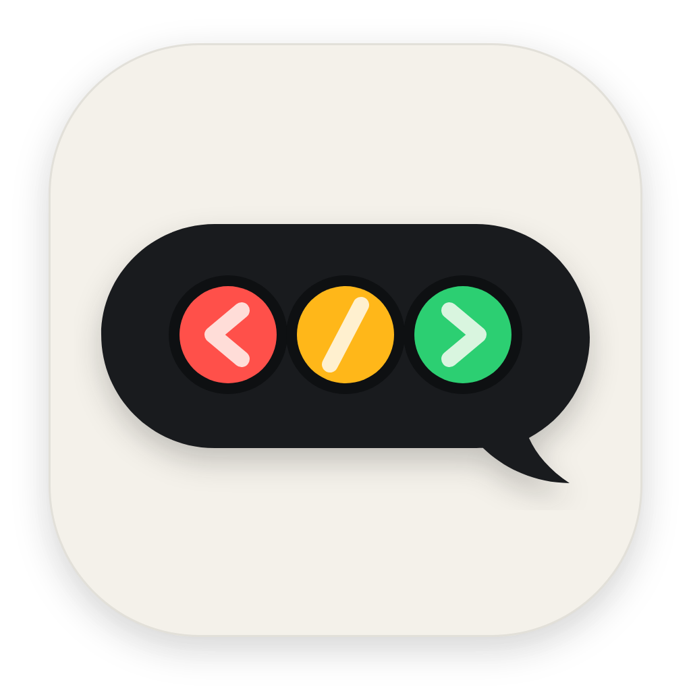

<p align="center">
  
</p>

<h1 align="center">Harbor Light</h1>

<p align="center"><strong>给 Coding Agent 装上一盏状态灯。</strong></p>

<p align="center">
  不用反复切回 Codex 或 Cursor，也能一眼看出 Agent 正在工作、等待确认，还是已经完成。
</p>

Harbor Light 把 **Codex** 和 **Cursor** 的实时状态变成可跨屏拖动的红黄绿悬浮窗。它按软件、项目和对话分别记账，多个任务可以同时亮灯，不会互相覆盖。当前版本为 **0.1.0**，支持 macOS 12+ 与 Windows 10/11（x64 / ARM64）；核心用 Rust 写成，不依赖 Python 或 Swift 运行时。

## 特性

- **一眼识别状态**：黄灯工作、红灯等待、绿灯完成，不用切窗口确认进度。
- **多任务状态聚合**：同时监控 Codex、Cursor 的多个项目和对话；一个任务完成不会盖住另一个仍在跑的任务。
- **轻量原生悬浮窗**：始终置顶、不抢焦点，可跨屏拖动并记住位置。
- **一次安装即可使用**：自动合并用户级 Codex / Cursor Hooks，并配置登录自启动。
- **macOS 与 Windows 原生支持**：Intel / Apple Silicon，以及 Windows x64 / ARM64。

___

## 效果预览

| 状态 | 含义 | 悬浮窗效果 |
| --- | --- | --- |
| 🟡 **工作中** | Agent 正在思考或执行任务 | 黄灯呼吸 |
| 🟢 **已完成** | 当前任务已经完成 | 绿灯弹出 |
| 🔴 **等待确认** | 需要用户审批或处理错误 | 红灯急促闪烁 |
| 🔴🟡 **等待确认 + 仍有任务运行** | 一个任务在等待，其他任务仍在执行 | 红黄灯同步急促闪烁 |
| ⚪ **空闲** | 当前没有活动任务 | 三灯低亮 |

> 拖动黑色胶囊即可跨屏摆放；窗口会记住位置。显示器拔除后若窗口留在屏幕外，会自动回到主屏右上方。
>
> macOS 可从菜单栏图标打开菜单；Windows 可右键系统托盘图标。两者都能查看当前状态、重新安装 Hooks 或退出。macOS 菜单额外提供「切换开机自启」。

___

## 一、工作原理

```text
Codex Hooks ─┐
             ├→ Provider 适配器 → ~/.harbor-light/activities/<provider>/*.json ─┐
Cursor Hooks ┘                                                                  ├→ 状态聚合 → 红绿灯悬浮窗
Codex rollout JSONL（兜底）──────────────────────────────────────────────────────┘
```

每个软件、每个对话都有独立活动文件。聚合规则：

| 并发组合 | 展示 |
| --- | --- |
| 至少一个 Waiting，且另一个对话 Working | 🔴🟡 红黄同步闪烁 |
| Waiting，没有其他 Working | 🔴 红灯闪烁 |
| 没有 Waiting，至少一个 Working | 🟡 黄灯呼吸 |
| 没有活动，至少一个 Done 尚未超时 | 🟢 绿灯弹出（约 3 秒后回空闲） |
| 全部 Idle / Done 已超时 | ⚪ 三灯低亮 |

只要仍有 Waiting 或 Working，已完成的绿灯就不参与组合。同一 Codex 会话可能同时出现在 Hook、旧状态文件 `~/.codex-status.json` 和 rollout JSONL 中，聚合前会按 Provider + 会话 ID 去重：**Hook 优先**，因此同一审批会话的 rollout `working` 兜底不会错误点亮黄灯。

App 在 macOS 用 FSEvents 监听活动文件和 Codex sessions，并每约 2 秒做一次兜底扫描；Windows 约每秒轮询一次进程、活动文件和 rollout。某个软件退出时，只清理该软件的活动，不影响另一个 Provider。连续 30 分钟没有新事件的活动会自动回到空闲。

___

## 二、安装（双击即可）

正式版本请从 [GitHub Releases](https://github.com/yuanmomoya/harbor-light/releases) 下载，**不要**把 `dist/` 里的安装包提交进 Git。

### macOS

把 `dist/HarborLight.pkg` 发给别人，**双击**就会打开 macOS 安装器，装到「应用程序」，并自动配置 Codex、Cursor 用户级 Hooks 和开机自启。

本地打安装包：

```zsh
make package
```

产物：

| 文件 | 用途 |
| --- | --- |
| **`dist/HarborLight.pkg`** | 双击安装（推荐分发这个） |
| `dist/HarborLight.app` | 已打包的 App |
| `dist/HarborLight.zip` | 压缩包备用 |

未签名时，系统可能提示无法打开：按住 **Control 点按** pkg → 打开 → 仍要打开。

Logo 的矢量源文件是 `resources/logo.svg`，README 使用的位图是 `resources/logo.png`。调整设计后，先把 SVG 导出为 1024 × 1024 的透明 PNG，再生成 macOS icns 和 Windows ico：

```zsh
make icon
make package
```

### Windows

推荐分发 `HarborLight-0.1.0-windows-x64-setup.exe`；ARM Windows 使用 `arm64-setup.exe`。安装器以当前用户权限安装到 `%LOCALAPPDATA%\HarborLight`，自动合并 `%USERPROFILE%\.codex\hooks.json` 和 `%USERPROFILE%\.cursor\hooks.json`、写入当前用户登录自启动并启动悬浮窗，不需要管理员权限。

当前本地 x64 安装包可以直接作为 GitHub Release 资源：

| 文件 | 大小 | 能否上传 Release |
| --- | --- | --- |
| `dist/windows/HarborLight-0.1.0-windows-x64-setup.exe` | 约 2.5 MB | 可以。远低于 GitHub 单个资源 **2 GiB** 上限 |
| `dist/windows/HarborLight-0.1.0-windows-x64-setup.exe.sha256` | 106 字节 | 可以，且应和安装包一起发布，方便校验 |

不要把这两个文件推进 Git 仓库：`.gitignore` 已排除 `/dist`，Git 也不是安装包的分发渠道。未代码签名时，Windows SmartScreen 可能拦截首次运行，选择 **更多信息 → 仍要运行** 即可。

下载后可用 PowerShell 核对哈希（应与 `.sha256` 文件一致）：

```powershell
Get-FileHash .\HarborLight-0.1.0-windows-x64-setup.exe -Algorithm SHA256
Get-Content .\HarborLight-0.1.0-windows-x64-setup.exe.sha256
```

本机这份安装包的 SHA-256 为：

```text
b2b3134d1c2e7e4f091c54c8ea9059cab1aa840d8cd7f3de76bae4e4e4e8f644
```

把这份本地包发到 GitHub Releases（网页或 CLI 均可）：

1. 打开 [New release](https://github.com/yuanmomoya/harbor-light/releases/new)
2. 标签填 `v0.1.0`（没有该标签时 GitHub 会创建），标题填 `Harbor Light 0.1.0`
3. 上传 `HarborLight-0.1.0-windows-x64-setup.exe` 和 `.sha256`（可选再加同目录的 `.zip`）
4. 说明可直接用下面这段：

```markdown
## Windows x64

推荐下载 `HarborLight-0.1.0-windows-x64-setup.exe`，双击安装。安装器以当前用户权限写入 `%LOCALAPPDATA%\HarborLight`，会合并 Codex / Cursor 用户级 Hooks，并配置登录自启动，不需要管理员权限。

当前包未做代码签名。若 SmartScreen 提示已阻止，选择 **更多信息 → 仍要运行**。

SHA-256：`b2b3134d1c2e7e4f091c54c8ea9059cab1aa840d8cd7f3de76bae4e4e4e8f644`
```

已安装 [GitHub CLI](https://cli.github.com/) 时也可以：

```powershell
git tag v0.1.0
git push origin v0.1.0
gh release create v0.1.0 `
  dist/windows/HarborLight-0.1.0-windows-x64-setup.exe `
  dist/windows/HarborLight-0.1.0-windows-x64-setup.exe.sha256 `
  --title "Harbor Light 0.1.0" `
  --notes "推荐下载 setup.exe 双击安装。未签名时 SmartScreen 可能拦截，选择更多信息 → 仍要运行。SHA-256: b2b3134d1c2e7e4f091c54c8ea9059cab1aa840d8cd7f3de76bae4e4e4e8f644"
```

推送 `v*` 标签还会触发 Actions，由 CI 再构建 x64 / ARM64 并挂到同一个 Release。CI 产物的哈希会和本机这份不同，这是正常的。

在 Windows PowerShell 7 中打包：

```powershell
./scripts/package-windows.ps1 -Architecture x64 -RequireInstaller
# Windows on ARM：
./scripts/package-windows.ps1 -Architecture arm64 -RequireInstaller
```

需要 Rust、MSVC Build Tools（勾选「Desktop development with C++」）和 [Inno Setup 6](https://jrsoftware.org/isinfo.php)。也可从 GitHub Actions 手动运行 **Windows packages**（推送 `v*` 标签也会触发），流水线会同时生成 x64 / ARM64，并在打标签时自动发布到 [GitHub Releases](https://github.com/yuanmomoya/harbor-light/releases)：

| 文件 | 用途 |
| --- | --- |
| `dist/windows/HarborLight-<版本>-windows-<架构>-setup.exe` | 双击安装（推荐） |
| `dist/windows/HarborLight-<版本>-windows-<架构>.zip` | 便携包，内含 `HarborLight.exe` |
| `*.sha256` | 产物完整性校验 |

便携包解压后需要先执行一次安装，才会写入 Hooks 和登录自启动：

```powershell
.\HarborLight.exe install
```

若设置环境变量 `HARBOR_LIGHT_CERT_THUMBPRINT`，脚本会使用 Windows SDK 的 `signtool.exe` 给 exe 和安装器做 SHA-256 签名与时间戳；未设置时会明确生成未签名包，首次下载可能触发 SmartScreen。

___

## 三、从源码安装

### macOS

**前置要求**

1. **macOS 12+**
2. **Rust**（[rustup](https://rustup.rs)，需要 `cargo`）
3. **Xcode Command Line Tools**：`xcode-select --install`
4. **Codex 桌面 App / CLI 或 Cursor**：至少安装一个需要监控的编程软件

```zsh
make install
# 或
./scripts/install.sh
```

安装脚本会编译 App → 写入图标 → 合并 Hooks → 配置开机自启 → 启动。App 默认装到 `~/Applications/HarborLight.app`（若 `/Applications` 可写则优先用它）。

> 首次新开 Codex 会话触发 Hook 时，Codex 可能弹窗要求「允许信任」，或提示到 `/hooks` 审查。

开发期也可以不安装，直接：

```zsh
cargo test
cargo run --release
```

### Windows

安装 Rust 和 Visual Studio Build Tools（勾选「Desktop development with C++」），然后在 PowerShell 中：

```powershell
cargo test
cargo build --release
./target/release/harbor-light.exe install
```

开发时直接运行 `cargo run --release`。Windows 悬浮窗是无边框、置顶且不抢焦点的原生 Win32 窗口，拖动后会把位置保存到 `%USERPROFILE%\.harbor-light-window-windows.json`。若已有实例在运行，再次启动只会把现有窗口唤到前面。

原生 Windows Codex 默认读取 `%USERPROFILE%\.codex`。如果 Codex 在 WSL2 内运行，应在 WSL 中把 `CODEX_HOME` 指向 `/mnt/c/Users/<Windows用户名>/.codex`，让 Windows 悬浮窗和 WSL 共用同一份会话数据；也可以在 Windows 用户环境变量中设置 `CODEX_HOME` 指向自定义目录。目录差异可参考 [OpenAI Windows 文档](https://learn.chatgpt.com/docs/windows/windows-app)。

___

## 四、Hooks 配置

一键安装会同时合并 Codex 和 Cursor 的用户级 Hooks，**不会覆盖**已有条目。手动配置时，命令路径必须使用**绝对路径**。

安装后的典型命令：

| 平台 | 二进制 |
| --- | --- |
| macOS | `/Applications/HarborLight.app/Contents/MacOS/harbor-light` |
| Windows | `%LOCALAPPDATA%\HarborLight\HarborLight.exe` |

### Codex

macOS 编辑 `~/.codex/hooks.json`，Windows 编辑 `%USERPROFILE%\.codex\hooks.json`：

```json
{
  "hooks": {
    "SessionStart": [{ "hooks": [{ "type": "command", "command": "/绝对路径/harbor-light hook --provider codex", "timeout": 3 }] }],
    "UserPromptSubmit": [{ "hooks": [{ "type": "command", "command": "/绝对路径/harbor-light hook --provider codex", "timeout": 3 }] }],
    "PreToolUse": [{ "hooks": [{ "type": "command", "command": "/绝对路径/harbor-light hook --provider codex", "timeout": 3 }] }],
    "PostToolUse": [{ "hooks": [{ "type": "command", "command": "/绝对路径/harbor-light hook --provider codex", "timeout": 3 }] }],
    "Stop": [{ "hooks": [{ "type": "command", "command": "/绝对路径/harbor-light hook --provider codex", "timeout": 3 }] }],
    "PermissionRequest": [{ "hooks": [{ "type": "command", "command": "/绝对路径/harbor-light hook --provider codex", "timeout": 3 }] }],
    "SessionEnd": [{ "hooks": [{ "type": "command", "command": "/绝对路径/harbor-light hook --provider codex", "timeout": 3 }] }]
  }
}
```

### Cursor

macOS 编辑 `~/.cursor/hooks.json`，Windows 编辑 `%USERPROFILE%\.cursor\hooks.json`。Cursor 使用扁平 Hook 数组，和 Codex 的嵌套格式不同；超时为 **8 秒**，避免长思考内容把 stdin 撑满后超时。

```json
{
  "version": 1,
  "hooks": {
    "beforeSubmitPrompt": [{ "command": "/绝对路径/harbor-light hook --provider cursor", "timeout": 8 }],
    "preToolUse": [{ "command": "/绝对路径/harbor-light hook --provider cursor", "timeout": 8 }],
    "beforeShellExecution": [{ "command": "/绝对路径/harbor-light hook --provider cursor", "timeout": 8 }],
    "afterShellExecution": [{ "command": "/绝对路径/harbor-light hook --provider cursor", "timeout": 8 }],
    "beforeMCPExecution": [{ "command": "/绝对路径/harbor-light hook --provider cursor", "timeout": 8 }],
    "afterMCPExecution": [{ "command": "/绝对路径/harbor-light hook --provider cursor", "timeout": 8 }],
    "afterAgentThought": [{ "command": "/绝对路径/harbor-light hook --provider cursor", "timeout": 8 }],
    "stop": [{ "command": "/绝对路径/harbor-light hook --provider cursor", "timeout": 8 }],
    "sessionEnd": [{ "command": "/绝对路径/harbor-light hook --provider cursor", "timeout": 8 }]
  }
}
```

### 事件映射

| Codex 事件 | 状态灯 |
| --- | --- |
| `SessionStart` / `UserPromptSubmit` / `PreToolUse` / `PostToolUse` | 🟡 working |
| `PermissionRequest` | 🔴 waiting |
| `Stop` / `SessionEnd` | 🟢 done（约 3 秒后回空闲） |

| Cursor 事件 | 状态灯 |
| --- | --- |
| `beforeSubmitPrompt` | 🟡 working |
| `preToolUse` / `beforeShellExecution` / `beforeMCPExecution` / `afterAgentThought` | 续期当前活动，不创建新任务 |
| 明确携带 `approval_required=true` 或 `permission=ask` / `prompt` / `required` 的事件 | 🔴 waiting |
| `afterShellExecution` / `afterMCPExecution` | 🟡 working（只更新已有活动，避免结束后被迟到事件重新点亮） |
| `stop(completed/aborted)` | 🟢 done（约 3 秒后回空闲） |
| `stop(error)` | 🔴 waiting / 需要处理 |
| `sessionEnd` | 清理该对话 |

Cursor 官方仍未提供独立的 `PermissionRequest` 或 Plan 审批事件，也没有字段能可靠区分“正在等待审批”和“即将执行”。因此本项目不会把 `beforeShellExecution(sandbox=false)` 近似为审批，避免 `winget`、安装依赖等正在执行的命令误亮红灯。只有明确审批字段或执行错误会显示红灯；普通 Cursor IDE 会话中的 Plan 审批目前无法通过 Hooks 被动识别。

用户级 Cursor Hooks 只监控本地 Agent；Cloud Agent 需要项目级 Hooks，本版本暂不自动配置。

### 兜底与边界

Codex 除 Hook 外还会扫描 `~/.codex/sessions/**/rollout-*.jsonl`，识别 `exec_approval_request`、`apply_patch_approval_request`、`request_permissions`、`request_user_input`、`elicitation_request` 等审批事件，以及 `task_complete` / `turn_aborted`。即使 Hook 尚未信任、漏触发或仍是旧安装，审批态也能作为兜底点亮红灯；手动停止尚未完成的回答时，会短暂显示绿灯后回到空闲，不会一直停在黄灯。

直接退出、强制退出或软件崩溃时：

- macOS 观察 Bundle ID：`com.openai.codex`、`com.todesktop.230313mzl4w4u92`
- Windows 观察进程名：`chatgpt.exe` / `codex.exe`、`cursor.exe`

只清理退出软件所属的活动。若关机、断电导致终止信号和结束事件都缺失，连续 30 分钟没有新事件的活动会自动回到空闲；恢复写入后会再次正常显示。

> `SessionEnd` 用来在会话结束时复位，避免卡在工作态。一键安装会**合并**进现有 Hooks，不会覆盖你自己的条目。

**验证**：新开会话后查看 `~/.harbor-light/activities/codex/` 或 `~/.harbor-light/activities/cursor/`，也可以查看 `~/.harbor-light.log`。Codex 仍会同步更新旧的 `~/.codex-status.json`，方便已有脚本读取。

手动联调四态（App 运行时）：

```zsh
# macOS
harbor-light set working
harbor-light set waiting
harbor-light set done
harbor-light set idle
```

```powershell
# Windows
& "$env:LOCALAPPDATA\HarborLight\HarborLight.exe" set working
& "$env:LOCALAPPDATA\HarborLight\HarborLight.exe" set waiting
& "$env:LOCALAPPDATA\HarborLight\HarborLight.exe" set done
& "$env:LOCALAPPDATA\HarborLight\HarborLight.exe" set idle
```

___

## 五、文件与命令

| 路径 | 用途 |
| --- | --- |
| `~/.harbor-light/activities/codex/` | Codex 各对话的活动 JSON |
| `~/.harbor-light/activities/cursor/` | Cursor 各对话的活动 JSON |
| `~/.codex-status.json` | Codex 兼容用的旧状态快照 |
| `~/.harbor-light.log` | 事件与安装日志 |
| `~/.codex/hooks.json` | Codex 用户级 Hooks |
| `~/.cursor/hooks.json` | Cursor 用户级 Hooks |
| `~/.codex/sessions/` | Codex rollout JSONL（兜底） |
| `~/.harbor-light-window-windows.json` | Windows 悬浮窗位置（仅 Windows） |

常用子命令：无参数启动悬浮窗；`hook --provider <codex|cursor>` 给 Hooks 调用；`status` 打印旧状态文件；`set <idle|working|waiting|done>` 手动写状态；`install` / `uninstall` 安装与卸载；`package` 只打包、不装 Hooks。

环境变量：`CODEX_HOME` 可覆盖 Codex 配置目录；测试可用 `HARBOR_LIGHT_HOME` 把全部状态文件指到临时目录。

___

## 六、排查

| 现象 | 排查 |
| --- | --- |
| 灯不亮 | macOS 看菜单栏、Windows 看系统托盘；确认 `harbor-light` / `HarborLight.exe` 正在运行 |
| 状态不变 | 检查 `~/.harbor-light/activities/<provider>/` 下的活动 JSON 和 `~/.harbor-light.log` |
| Codex Hook 没触发 | 检查日志；Codex 是否已在 `/hooks` 里允许信任 |
| Cursor Hook 没触发 | 检查 `~/.cursor/hooks.json` 和 Cursor 的 Hooks 输出面板，必要时重启 Cursor |
| Cursor 思考很长但灯灭了 | 确认 Cursor Hook 超时为 8 秒；截断的 JSON 会被尽量抢救，但完整事件更可靠 |
| 悬浮窗不见了 | 重新连接显示器，或重启 App；离屏位置会自动回到主屏右上方 |
| 首次不生效 | 检查 Codex 弹窗是否点了允许信任；或从菜单 / 托盘选「重新安装 Hooks」 |
| Windows 便携包没反应 | 先运行 `HarborLight.exe install`，不要只双击 exe |

___

## 七、卸载

```zsh
make uninstall
# 或
./scripts/uninstall.sh
```

Windows 可在「设置 → 应用」中卸载，也可执行：

```powershell
& "$env:LOCALAPPDATA\HarborLight\HarborLight.exe" uninstall
```

卸载会停止 App → 移除 LaunchAgent / 当前用户注册表自启动 → 只清理 Codex、Cursor `hooks.json` 中本工具写入的条目 → 删除活动状态、日志和窗口位置，不会覆盖或删除用户已有的其他 Hooks。
